# Nada's Kitchen

Nada's Kitchen is a fictional catering business located Dublin, Ireland. The app is a kitchen app that takes customer orders 48 hours in advance. The app is designed to allow customers to view the food menu and place orders online. It also provides customers with a simple, easy to use ordering system that connects to their registered profile.
The live link can be found here: [Live Site - Nada's Kitchen](https://nadas-cuisine-ca42fb816afa.herokuapp.com/)

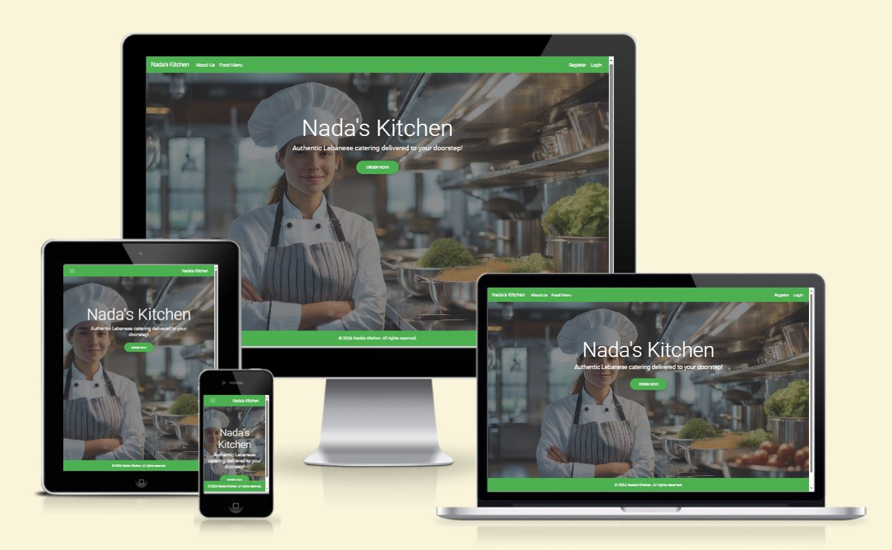

## Table of Contents
- [Sizzle and Steak](#nada's-kitchen)
    - [Table of Contents](#table-of-contents)
- [User-Experience-Design](#user-experience-design)
    - [The-Strategy-Plane](#the-strategy-plane)
    - [Site-Goals](#site-goals)
    - [Agile Planning](#agile-planning)
        - [Milestones](#milestones)
        - [Issues](#issues)
    - [The-Scope-Plane](#the-scope-plane)
    - [The-Structure-Plane](#the-structure-plane)
    - [Features](#features)
    - [Features Left To Implement](#features-left-to-implement)
  - [The-Skeleton-Plane](#the-skeleton-plane)
    - [Wireframes](#wireframes)
    - [Database-Design](#database-design)
    - [Security](#security)
  - [The-Surface-Plane](#the-surface-plane)
    - [Design](#design)
    - [Colour-Scheme](#colour-scheme)
    - [Typography](#typography)
    - [Imagery](#imagery)
  - [Technolgies](#technolgies)
  - [Testing](#testing)
  - [Deployment](#deployment)
    - [Version Control](#version-control)
    - [Heroku Deployment](#heroku-deployment)
    - [Run Locally](#run-locally)
    - [Fork Project](#fork-project)
  - [Credits](#credits)


# User-Experience-Design

## The-Strategy-Plane

### Site-Goals

The site is aimed to help customers make quick orders from the UI without the need to call the catering company, while enabling the business staff to add menu items from the backend and an enhanced capability to delete a menuitem from the UI. 

The site enables customers to create, view and update their login profiles to aid customer contact and delivery addresses.  

### Agile Planning

This project was developed using agile methodologies by delivering small features in incremental sprints. 
There were 3 sprints in total.

The project enabled issues, prioritized under the labels, Must have, should have, could have and won't have. Labels were assigned to sprints and story pointed according to complexity. "Must have" stories were completed first, "should haves" and then finally "could haves". It was done this way to ensure that all core requirements were completed first, however, the sprints were completed concurrently due to granular requirements that may have been placed on hold until a complete solution was developed.

The Kanban board was created using github projects and can be located [here](https://github.com/users/jjsemaan/projects/4) and can be viewed to see more information on the project cards. All issues have a full set of acceptance criteria in order to define the functionality that marks that issue as complete.

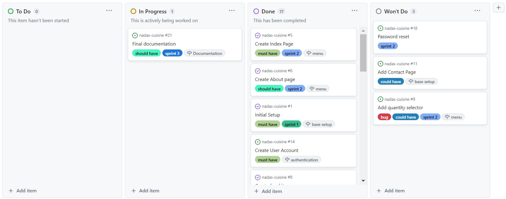

#### Milestones

The project had 6 main milestones:

**Milestone 1 - Base Setup**

The base setup milestone is for all issues needed for the base set up of the application. Without the base setup, the app would not be possible so it was the first milestone to be delivered as all other features depend on the completion of the base setup.

**Milestone 2 - Menu Page**

The menu pages milestone was used for the food menu page and for other small pages. Instead of creating milestones for tiny features, these small deliverables were all added here.

**Milestone 3 - Authentication**

The authentication milestone is for all issues related to the registration, login and authorisation of views. This milestone provides critical functionality and value as without it the customer would not be able to make orders securely.

**Milestone 4 - Order**

The order milestone is used for the development of user models that enable CRUD functionality in the site.

**Milestone 5 - Flash Messages**

The flash messages milestone is used in the development of views that enable notifications by either levereging Django built-in messaging or via JavaScript.

**Milestone 6 - Documentation**

The flash messages milestone is used in the development of views that enable notifications by either levereging Django built-in messaging or via JavaScript.

#### Issues

The following issues (by sprint) were completed over a period of four weeks:

**Sprint 1**

As a developer, I need to set up the project and run Django in the browser so that the project is ready for implementation.

As a developer, I need to setup and deploy my project on Heroku to make sure that it is progressing as expected.

As a developer, I need to create a database to enable CRUD functionality.

As a developer, I need to create the base.html to to be reused by other pages.

**Sprint 2**

As a developer, I need to create a user intuitive homepage to facilitate UX.

As a developer, I need to create an About page to inform the users about the site.

As a developer, I need to create a food menu page for the customer's UX.

As a developer, I need to create a food menu for the customer to enable connection to ordering food.

As a developer, I need to create user registration in order to authenticate customers.

As a developer, I could give the user the ability to change their password when logged in.

As a developer, I need to extend the user profile to include **user delivery address and phone number" by adding CRUD functionality so that the customer is capable of updating their profile if need be.

As a developer, I need to style my authentication forms so that they are more intuitive and neat.

As a developer, I need to create an order confirmation page so that the customer can review their order prior to payment.

**Sprint 3**

As a developer I need to add flash messages on my website to acknowledge button actions.

As a developer I need to add a date picker so that the customer can select their preferred delivery date.

As a developer I need to create a README file to provide guided lines to app users.

## The-Scope-Plane

* Responsive Design - Site should be fully functional on all devices from 280px up
* Hamburger menu for mobile devices
* Ability to perform CRUD functionality (from UI) Create, Read, Update for User Profiles and full CRUD for admin from back end in addition to Admin Delete functionality (from UI). 
* Restricted role based features
* Home and About page with business information

## The-Structure-Plane

### Features

**Navigation Menu**

 The Navigation contains links for Home, Bookings, Menus and has auth options.

The following navigation items are available on all pages:
  * Home            -> index.html           - Visible to all.
  * About Us        -> about.html           - Visible to all.
  * Orders          -> order.html           - Visible upon login authentication. This is the food menu.
  * Order Details   -> orderconfirm.html    - Visible once Place Order button is clicked.
  * Profile         -> profile.html         - Visible to all logged-in customers.
  * Profile Update  -> profile-update.html  - Visible to all logged-in customers to update their details.
  * Login           -> login.html           - Visible to logged out users
  * Register        -> register.html        - Visible to logged out users
  * Change Password -> change-password.html - Visible to logged-in users

The navigation menu is displayed on all pages and drops down into a hamburger menu on smaller devices. This will allow users to view the site from any device and not take up too much space on mobile devices.


Implementation:

**Home Page**

The home page contains a background image of a chef standing in her kitchen with a slogan and an Order button in the foreground. This will immediately make it evident to the user, what the purpose of the website is.

The order button provides access to the food menu and is restricted to logged-in users. 

**Footer**

A footer has been added to the bottom of the site with copyright credits.

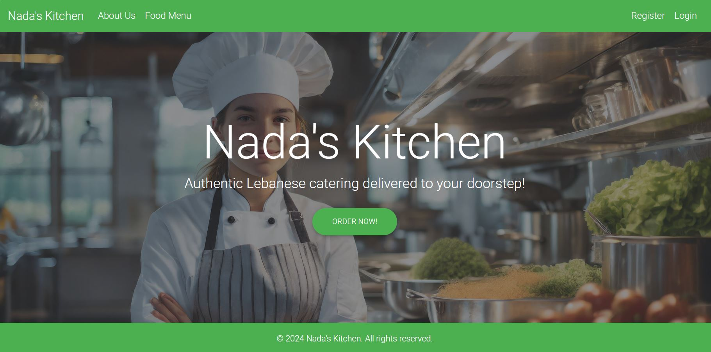


**Login Page**

A Login page restricts access to the food and ordering menu.

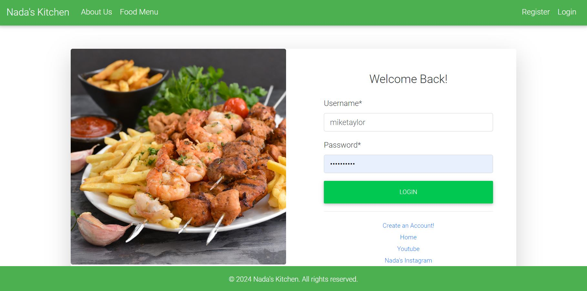


**About Page**

About page highlights the chef's specialty and considerations when ordering. Imprtant info in this page are popping out in bold.

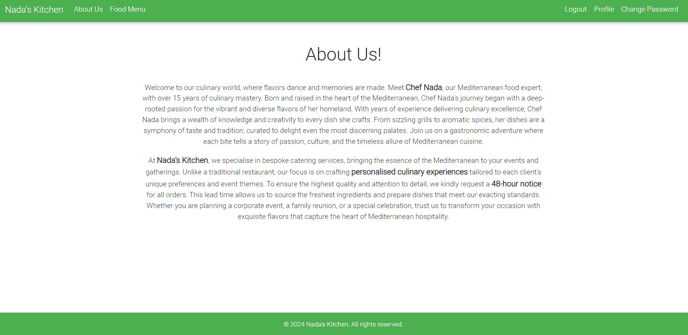


**Food Menu Ordering, Order Summary and Delete food item Pages**

A food menu page ordering page was implemented to allow customers to make orders and request particular delivery dates from the UI. The Delete anchor beside each item is accessible only to admins leading to a delete item confirmation page.
Once an order is made, customer is redirected to an Order Summary page acting as an e-receipt. 

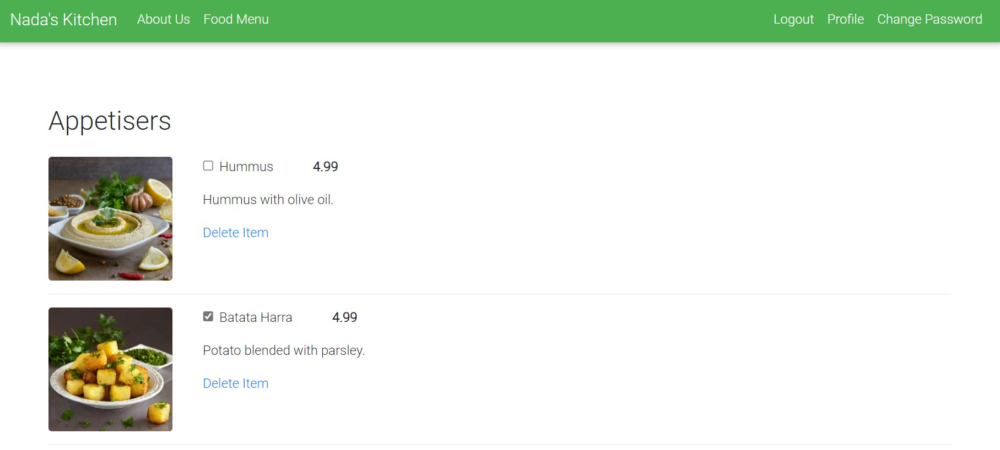
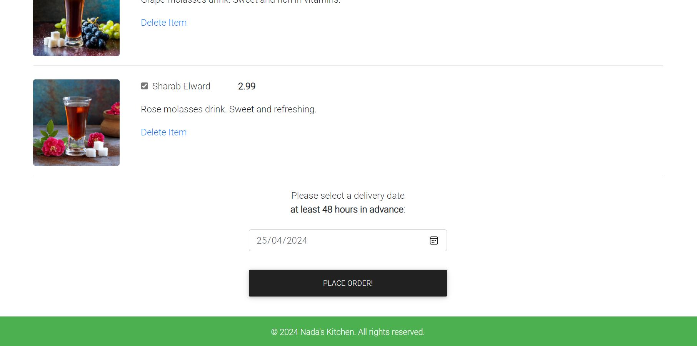

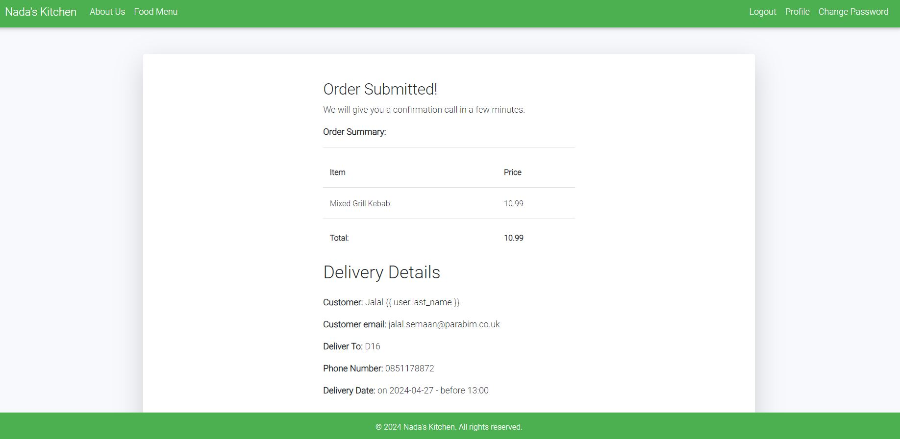

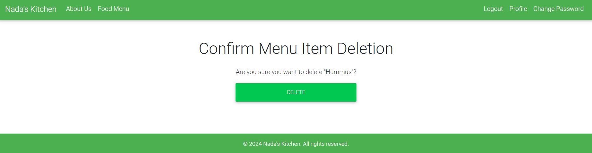

**User Profile, Update Profile and Change Password Pages**

A user profile and update profile pages were added to enable the addition of user delivery details and to provide a means to update these details should a customer change their phone number or address. 
A change password page was also added.

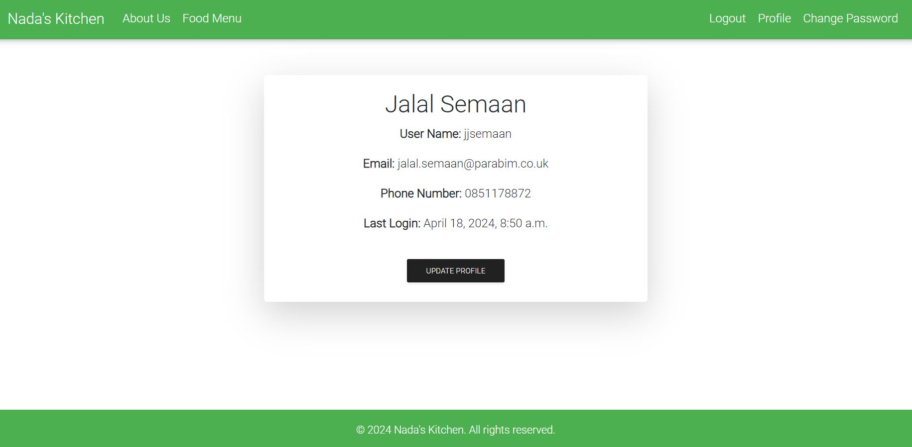

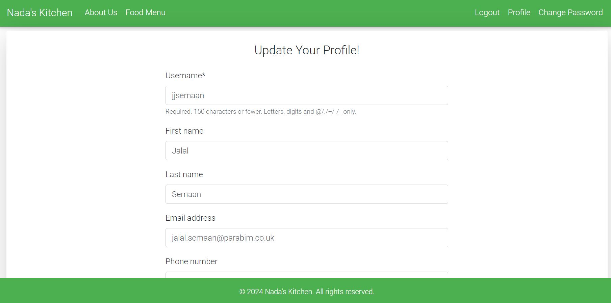

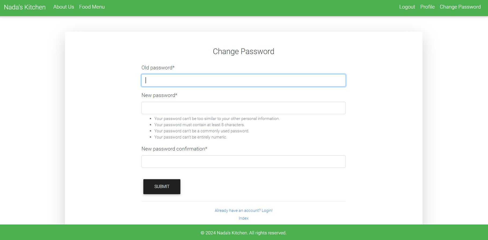

**Error Pages**
Error pages added to enable error handling.

**404 Page**

The 404 page will allow the user to easily navigate back to the main website if they direct to a broken link / missing page, without the need  of the browsers back button.

**403 Page**

A 403 error page has been implemented to provide feedback to the user when they try to access unauthorized content. Users will be directed to this page if they alter the URL's and attempt to edit, delete or access pages that are restricted. 

**500 Page**

A 500 error page has been displayed to alert users when an internal server error occurs. The message relays to users that the problem is on our end, not theirs.

### Features Left To Implement
- In a future release I would like to implement a quantity selector for each item in the food menu. 
- I would also like to add admin UI CRUD functionality to the menu items.
- User email authentication would also make a significant addition.

## The-Skeleton-Plane

### Wireframes

- The wireframe was created on proto.io which provides an interactive mockup of the site and page [Wireframe](https://share.proto.io/UHQVVA/).


### Database-Design

The database was designed to allow CRUD functionality to be available to registered users, when signed in. The user model is at the heart of the application as it is connected the the main ordering tables, linked by primary/foreign key relationships.

Orders are related to the customer (user) by a Foreign Key,

Entity relationship diagram was created using [Navicat](https://www.navicat.com/) and shows the schemas for each of the models and how they are related.

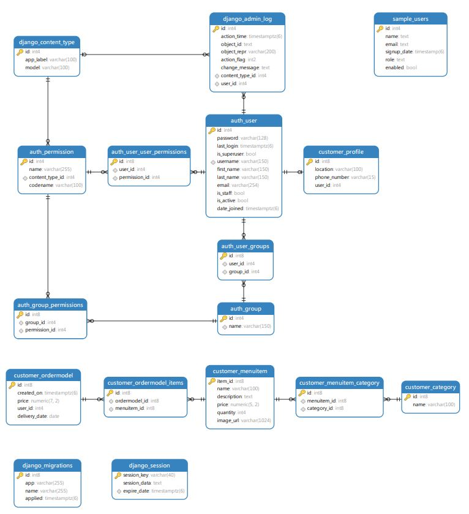

### Security

Views were secured by using the django class based view mixin, UserPassesTextMixin. Manual testing was implemented to ensure that the user who is trying to access the page is authorised. 

Environment variables were stored in an env.py for local development for security purposes to ensure no secret keys, api keys or sensitive information was added the the repository. In production, these variables were added to the heroku config vars within the project.

## The-Surface-Plane
### Design

### Colour-Scheme

The main color schemes for the website are black (Bootstrap4 navbar-dark green ) navs and a mix of white and #868e96 backgrounds.

### Typography

The Roboto font was used throughout the website. This font is from google fonts and was imported into the style sheet.

### Imagery

All images on the website were generated using Adobe Firefly AI.


## Technolgies

- HTML
  - The structure of the Website was developed using HTML as the main language.
- CSS
  - The Website was styled using custom CSS in an external file.
- JavaScript
  - JavaScript was used to make the custom slider on the menu page change and the bootstrap date picker.
- Python
  - Python was the main programming language used for the application using the Django Framework.
- Codeanywhere
  - The website was developed using Codeanywhere IDE
- GitHub
  - Source code is hosted on GitHub
- Git
  - Used to commit and push code during the development of the Website
- Font Awesome
  - This was used for various icons throughout the site

**Python Modules Used**

* Django Class based views (SignUpView, Order, ProfileView, ProfileUpdateView, DeleteMenuItem, CustomLoginView) - Used for the classes to create, read, update and delete
* Mixins (LoginRequiredMixin, UserPassesTestMixin) - Used to enforce login required on views and test user is authorised to perform actions
* messages - Used to pass messages to the toasts to display feedback to the user upon actions

**External Python Modules**

* asgiref==3.8.1
* crispy-bootstrap4==2024.1
* dj-database-url==0.5.0
* Django==4.2.11
* django-crispy-forms==2.1
* gunicorn==20.1.0
* psycopg2==2.9.9
* pytz==2024.1
* sqlparse==0.4.4
* whitenoise==6.5.0
* black==24.4.0

## Testing

All tested manually.

## Deployment

### Version Control

The site was created using the Codeanywhere editor and pushed to github to the remote repository ‘JJSemaan’.

The following git commands were used throughout development to push code to the remote repo:

```git commit -m “commit message”``` - This command was used to commit changes to the local repository queue ready for the final step.

```git push``` - This command was used to push all committed code to the remote repository on github.

### Heroku Deployment

The site was deployed to Heroku. The steps to deploy are as follows:

- Navigate to heroku and create an account
- Click the new button in the top right corner
- Select create new app
- Enter app name
- Select region and click create app
- Click the resources tab and search for Heroku Postgres
- Select hobby dev and continue
- Go to the settings tab and then click reveal config vars
- Add the following config vars:
  - SECRET_KEY: (Your secret key)
  - DATABASE_URL: (This should already exist with add on of postgres)
- Click the deploy tab
- Scroll down to Connect to GitHub and sign in / authorize when prompted
- In the search box, find the repositoy you want to deploy and click connect
- Scroll down to Manual deploy and choose the main branch
- Click deploy

The app should now be deployed.

The live link can be found here: [Live Site](https://nadas-cuisine-ca42fb816afa.herokuapp.com/)

### Run Locally

Navigate to the GitHub Repository you want to clone to use locally:

- Click on the code drop down button
- Click on HTTPS
- Copy the repository link to the clipboard
- Open your IDE of choice (git must be installed for the next steps)
- Type git clone copied-git-url into the IDE terminal

The project will now have been cloned on your local machine for use.

### Fork Project

Most commonly, forks are used to either propose changes to someone else's project or to use someone else's project as a starting point for your own idea.

- Navigate to the GitHub Repository you want to fork.

- On the top right of the page under the header, click the fork button.

- This will create a duplicate of the full project in your GitHub Repository.

## Credits 

Adobe Firefly AI Image Generator


